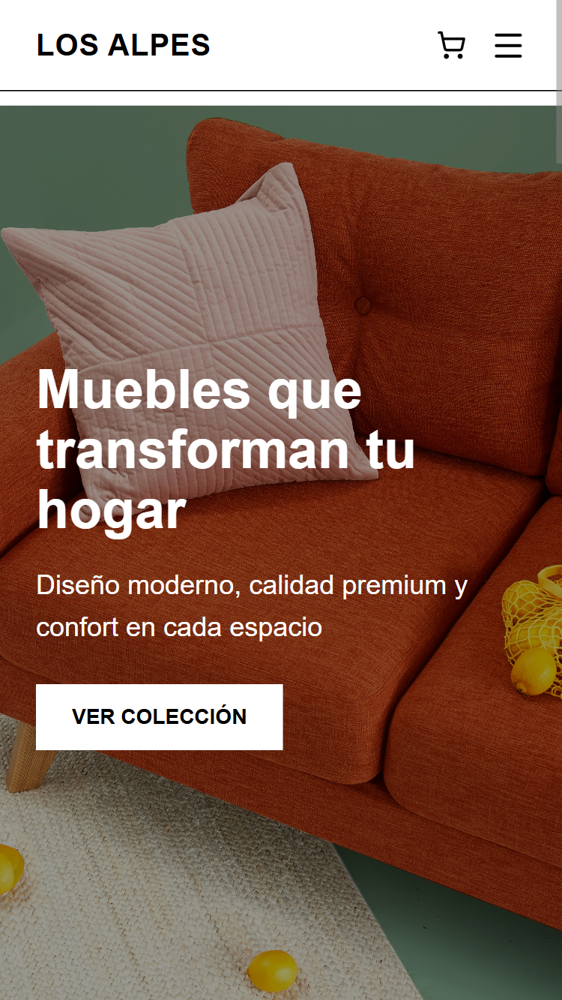
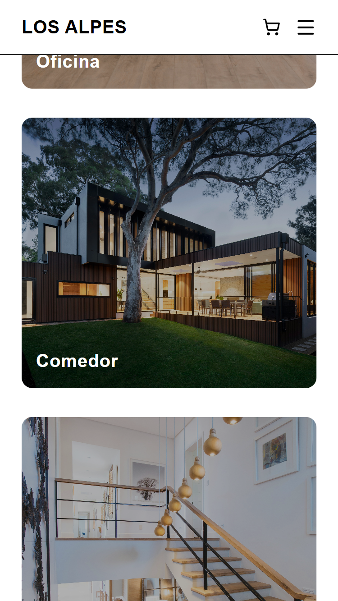

## Los Alpes - Mueblería

Este proyecto consiste en el desarrollo de una aplicación web para una mueblería llamada **Los Alpes**, con el objetivo de mostrar sus productos de manera organizada y visualmente atractiva.

Forma parte de un proyecto universitario enfocado en el desarrollo de interfaces modernas y la simulación de un sistema tipo ecommerce.

---

## Objetivo

El objetivo principal es diseñar una plataforma web que permita:

- Visualizar diferentes tipos de muebles
- Navegar entre categorías
- Preparar la base para futuras funcionalidades como filtros, compras y gestión de productos

---

## Estructura del proyecto

/app  
  /productos → Página de listado de productos  
  /scanner → Funcionalidad de escaneo (en desarrollo)  
  page.tsx → Página principal  

/components  
  Header  
  Footer  
  Cards  

---

## Funcionalidades actuales

- Interfaz moderna y responsive
- Navegación entre páginas
- Visualización de productos mediante cards
- Diseño enfocado en experiencia de usuario

---

## Trabajo futuro

- Implementación de filtros dinámicos
- Conexión con backend
- Base de datos de productos
- Sistema de autenticación
- Carrito de compras

---

## Ejecución del proyecto

git clone https://github.com/ro-garcia/los.alpes.muebleria/
cd los.alpes.muebleria
cd frontend
npm install
npm run dev

---

## Preview

### Página principal

  

### Vista de productos

  

---
